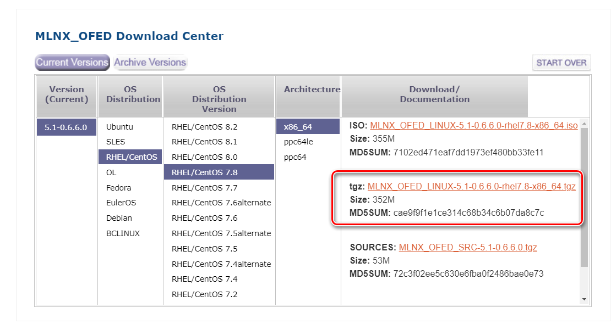
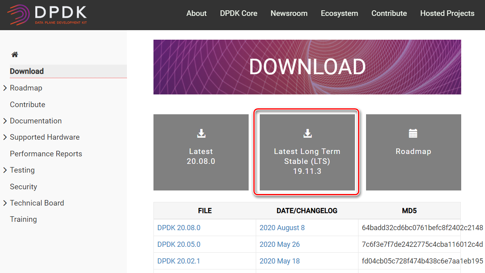
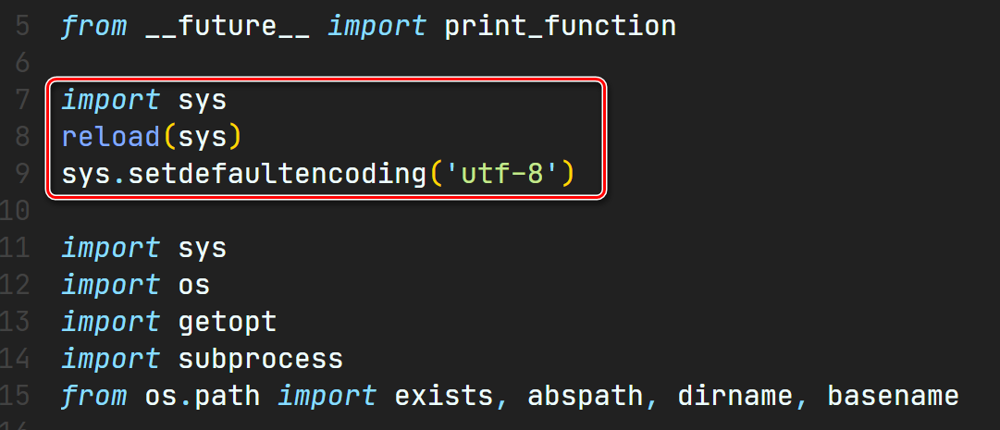
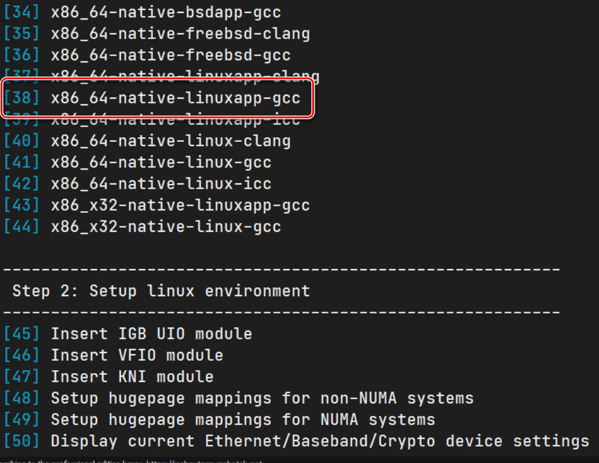
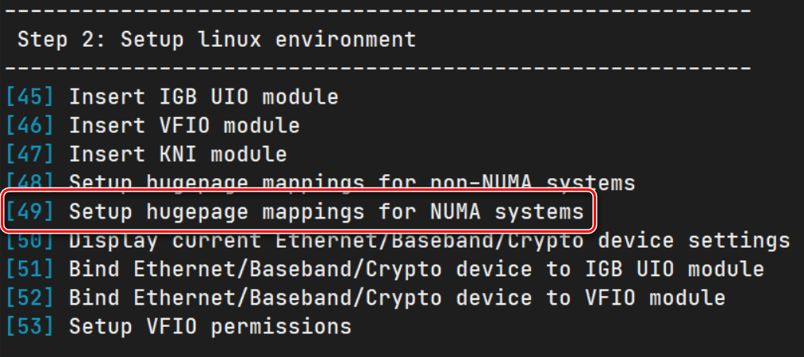

主要参考：

<https://doc.dpdk.org/guides/nics/mlx5.html#quick-start-guide-on-ofed-en>

<https://blog.csdn.net/qq_16088269/article/details/103477194>

# 环境

网卡：Mellanox MCX515A

系统：CentOS 7.8

DPDK: dpdk-19.11.3

网卡驱动：MLNX_OFED_LINUX-5.1-0.6.6.0-rhel7.8-x86_64

# 下载

## Mellanox 网卡驱动

进入 Mellanox 官网：<https://cn.mellanox.com/>

打开“以太网驱动程序”支持


选择 OFED 驱动

注意：不能安装 Mellanox EN 驱动，否则会在编译 DPDK 时出错，提示找不到 <infiniband/verbs.h>


在找开页面选择对应 CentOS 7.8 版本的驱动程序包



下载得到文件：

MLNX_OFED_LINUX-5.1-0.6.6.0-rhel7.8-x86_64.tgz

## DPDK 源码

在 DPDK 官网首页打开下载页面


选择长期支持版 19.11.3



下载得到文件：

dpdk-19.11.3.tar.xz

# 安装 Mellanox 网卡驱动

将下载得到的驱动程序包解压，在终端首先转为 root 用户：

>   sudo su

进入解压后的文件夹，执行安装指令：

>   ./mlnxofedinstall --upstream-libs --dpdk --add-kernel-support

其中 --add-kernel-support 用于解决驱动程序与当前 CentOS 系统 Kernel 版本不匹配的问题

安装时间较长，执行结束后根据提示在终端运行：

>   dracut -f
>
>   /etc/init.d/openibd restart

完成后重启主机

>   reboot

注意：==如果驱动安装失败，可以尝试升级系统内核==

# 编译 DPDK

将下载得到的 DPDK 源码包解压

进入解压后的文件夹，为添加 Mellanox 网卡的 MLX5 poll mode driver，==修改 config/defconfig_x86_64-native-linuxapp-gcc 文件==，在文件末尾加入一行：

>   CONFIG_RTE_LIBRTE_MLX5_PMD=y

==修改 config/common_base 文件，编译生成 DPDK 接口的共享库==，将原文中

>CONFIG_RTE_BUILD_SHARED_LIB=n
修改为

>   CONFIG_RTE_BUILD_SHARED_LIB=y

==打开 usertools/dpdk-devbind.py 文件，解决 Python 文本编码错误==

在原文中添加下图中的内容：



在终端转为 root 用户：

>   sudo su

配置环境变量

>   export RTE_SDK=/home/bt/dpdk
>
>   export RTE_TARGET=x86_64-native-linuxapp-gcc

安装辅助软件

>   apt-get install numactl
>
>   apt-get install libnuma-dev
>
>   apt-get install net-tools

进入 dpdk 的 usertools 目录，运行 dpdk-setup.sh

>   ./dpdk-setup.sh

根据提示选择 Option: 38 编译 dpdk 源码



完成编译后，选择 Option: 49 配置大页内存



按提示配置为 1024 个 2MB 大页

选择 Option: 50 查看当前网卡状态


显示 Mellanox 网卡当前驱动为 mlx5_core，状态正确


选择 Option: 62 退出当前 sh 脚本

# 示例程序添加 librte_pmd_mlx5 库

为了使用 Mellanox 网卡的 MLX5 poll mode driver，必须在示例程序的 Makefile 文件的最后 1 个 CFLAGS 配置之后加上以下语句

>   CFLAGS += -lrte_pmd_mlx5

用于添加 librte_pmd_mlx5 库

# 异常处理

## DPDK 编译失败

运行 DPDK 编译时如果出现 gcc 编译失败提示：

>   gcc: internal compiler error

网上很多说明表示原因在于内存不足，但是在测试主机内 96GB 内存应当不会出现不够 gcc 编译使用的情况。

于是尝试多次重启，==由于编译器可以自动增量编译，上次失败前已编译的结果仍然会保留，重启并且多次重复编译可以最终完成全部编译项==

## 驱动未加载

如果出现如下驱动未加载的错误提示


则手动载入网卡驱动

>   modprobe -a ib_uverbs mlx5_core mlx5_ib

## 网卡无法打开

`rte_eth_dev_start()`函数返回 -12 无法打开网卡，很可能的原因是系统 kernel 被更改，导致安装的驱动与当前系统不符合

参考以下切换系统 kernel：

<https://www.cnblogs.com/lolau/p/8964303.html>

查看当前 kernel

>   uname -r

查看可用 kernel 列表

>   awk -F\' '$1=="menuentry " {print i++ " : " $2}' /etc/grub2.cfg

查看默认启动 kernel

>   grub2-editenv list

更改默认启动 kernel，数字即 kernel 列表中的数值

>   grub2-set-default 1

重启

>   reboot

不确定：==升级 kernel 使用 `yum install kernel-devel`==

# 编译封装 so 库文件供 QtCreator 调用

将以下代码保存成文本文件 compile

```bash
export CFLAGS=
CFLAGS+="-DALLOW_EXPERIMENTAL_API -O3 -Wno-deprecated-declarations -shared -fPIC -o libraw_dpdk.so" 
export LDLIBS=
LDLIBS+="-lrte_pmd_bond -lrte_pmd_dpaa -lrte_mempool_dpaa -lrte_pmd_ixgbe -lrte_pmd_i40e -lrte_pmd_bnxt -lrte_pmd_softnic -lrte_pmd_mlx5 -lrte_flow_classify -lrte_pipeline -lrte_table -lrte_port -lrte_pdump -lrte_distributor -lrte_ip_frag -lrte_meter -lrte_lpm -lrte_acl -lrte_jobstats -lrte_metrics -lrte_bitratestats -lrte_latencystats -lrte_power -lrte_efd -lrte_bpf -lrte_cfgfile -lrte_gro -lrte_gso -lrte_hash -lrte_member -lrte_vhost -lrte_kvargs -lrte_mbuf -lrte_net -lrte_ethdev -lrte_bbdev -lrte_cryptodev -lrte_security -lrte_compressdev -lrte_eventdev -lrte_rawdev -lrte_timer -lrte_mempool -lrte_mempool_ring -lrte_ring  -lrte_pci -lrte_eal -lrte_cmdline -lrte_reorder -lrte_sched -lrte_kni -lrte_common_cpt -lrte_common_octeontx -lrte_common_dpaax -lrte_bus_pci -lrte_bus_vdev -lrte_bus_dpaa -lrte_bus_fslmc"
gcc $CFLAGS raw_dpdk.c -L/home/bt/dpdk/x86_64-native-linuxapp-gcc/lib/ $LDLIBS -L/usr/lib64/ -lpthread -I/home/bt/dpdk/x86_64-native-linuxapp-gcc/include/ -I/usr/include/ -mssse3

```

line2 的 libraw_dpdk.so 为生成的共享库文件名

其中 line5 的 raw_dpdk.c 用源代码文件（单个或者多个）代替，不用加入 .h 的函数声明文件

其中 `/home/bt/dpdk/x86_64-native-linuxapp-gcc/lib/` 是 DPDK 编译输出库目录，包含有 DPDK 编译生成的全部 so 共享库文件

`/home/bt/dpdk/x86_64-native-linuxapp-gcc/lib/` 是 DPDK 编译生成的包含目录，包含有代码所需的全部 DPDK 头文件

在终端转为 root 用户：

>   sudo su

用终端指令配置 compile 文件为可执行

>   chmod +x compile

配置环境变量

>   export RTE_SDK=/home/bt/dpdk
>
>   export RTE_TARGET=x86_64-native-linuxapp-gcc

在源代码相同目录下执行 compile

>   ./compile

在当前目录下生成 libraw_dpdk.so 共享库文件

在 Qt 工程中添加生成的 libraw_dpdk.so 库文件，以及 DPDK 编译输出库目录下的 libdpdk.so 库文件

并且在调用 .h 文件时使用 `extern "C" {}` 包含 #include 声明