本文档及此文档系列中使用zcu102开发板的全部文档均使用以下开发环境：

-   zcu102开发板
-   Windows 10
-   Vivado 2018.2.1
-   Matlab 2017b

---

# 建立工程

启动Vivado，选择Create Project

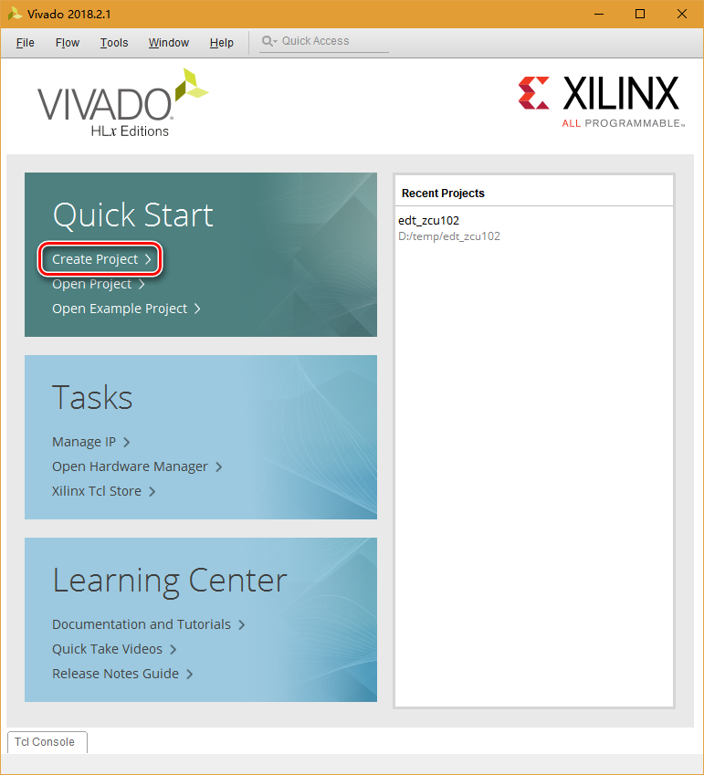

进入新建工程向导

在Project Name页设置工程名称及路径


在Project Type页选择RTL Project，并且选中Do not specify sources at this time


在Default Part页选择zcu102开发板

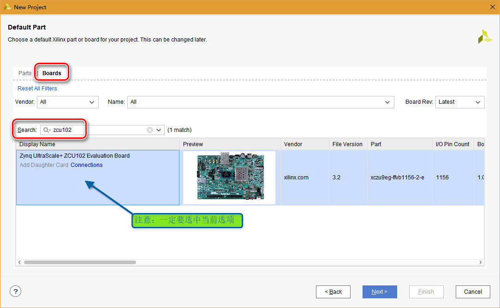

完成后点击Finish，建立工程完毕

# 添加时钟

根据ug1182 zcu102 evaluation board user guide，当前工程使用板上125MHz固定频率差分时钟。

由于管脚所在Bank为HIGH_DENSITY IO Bank，不能使用PLL或者MMCM等时钟模块，因此先由IBUFDS转化为单端时钟后直接使用。IBUFDS调用代码见[添加设计文件](#添加设计文件)部分的代码。

# 添加设计文件

在Sources窗口选择Add Sources


在弹出的Add Sources窗口，选择Add or create design sources


在Add or Create Design Sources页选择Create File

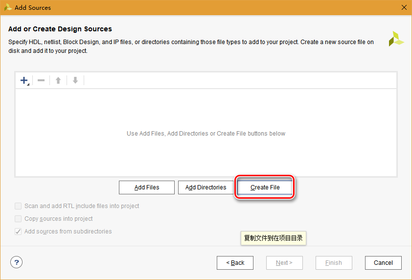

在弹出窗口中输入文件名称

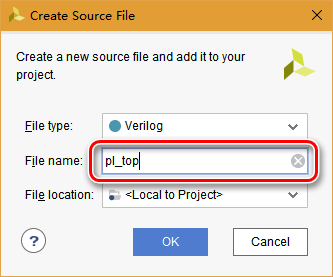

回到Add Sources窗口点击Finish


弹出的Define Module窗口中设置模块的输入输出端口，并选择OK


在Sources窗口双击新建的模块，编辑代码


打开代码后可以看到前述流程中自动添加的端口定义

```verilog
module pl_top(
    input clk_p,
    input clk_n,
    output [7:0] leds
    );
endmodule
```

完成代码如下：

```verilog
module pl_top(
    input clk_p,
    input clk_n,
    output [7:0] leds
    );
    
    wire clk;//125MHz工作时钟
    
    //用原语实现差分时钟转单端
    IBUFDS
    #(
    .IOSTANDARD("DEFAULT")//DEFAULT默认所有情况
    )
    IBUFDS_inst
    (
    .O(clk),//输出
    .I(clk_p),//P端输入
    .IB(clk_n)//N端输入
    );
    
    //定义输出寄存器
    reg [7:0] leds = 8'b0000_0001;
    
    //计数器，计时1秒，计数范围0~27'd125_000_000-1
    reg [26:0] cnt = 27'd0;
    
    always @(posedge clk) begin
        case (cnt)
            27'd124_999_999: begin
                cnt <= 27'd0;//计数复位
                leds <= {leds[6:0], leds[7]};//循环移位
            end
            
            default: begin
                cnt <= cnt+27'd1;//计数
                leds <= leds;//保持
            end
        endcase
    end
    
endmodule
```

# 添加约束文件

使用与前述相同的方法打开Add Sources窗口，选择Add or create constraints

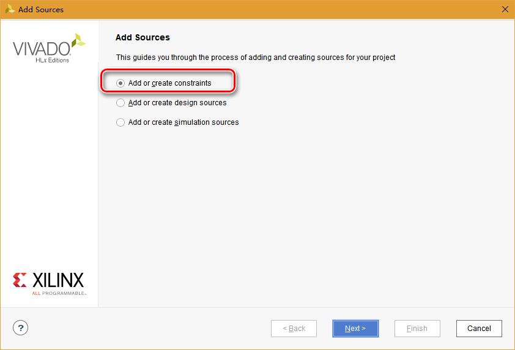

选择Create File，建立xdc约束文件，点击Finish完成

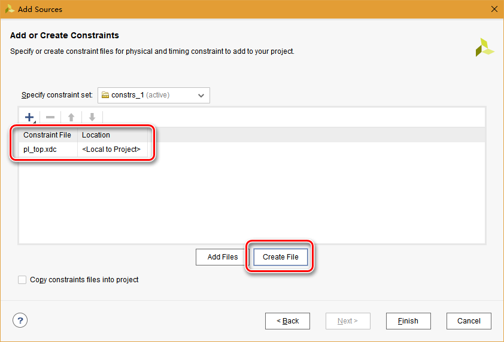

在Sources窗口可以看到新建立的约束文件

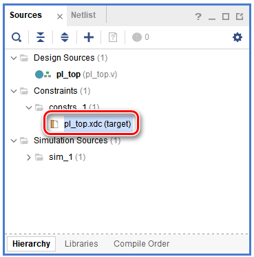

# 综合

在SYNTHESIS选择Run Synthesis

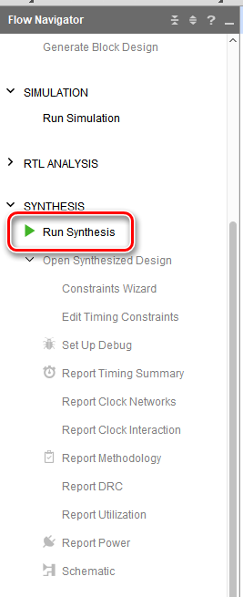

弹出窗口按默认设置选择OK开始综合

综合结束后在弹出窗口选择Open Synthesized Design（或者在Flow Navigator的SYHTHESIS项下选择）


# 添加管脚约束

在Layout菜单选择I/O Planning

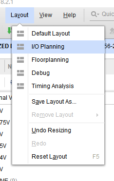

在I/O Ports页设置所有顶层管脚的Package Pin和I/O Std（参考ug1182）


选择保存弹出Out of Date Design，选择OK

接下来弹出的Save Constraints窗口中指定前述建立的xdc约束文件


在Sources窗口双击打开pl_top.xdc文件可以看到保存的管脚约束代码

```verilog
set_property PACKAGE_PIN AL12 [get_ports {leds[7]}]
set_property PACKAGE_PIN AH14 [get_ports {leds[6]}]
set_property PACKAGE_PIN AH13 [get_ports {leds[5]}]
set_property PACKAGE_PIN AJ15 [get_ports {leds[4]}]
set_property PACKAGE_PIN AJ14 [get_ports {leds[3]}]
set_property PACKAGE_PIN AE13 [get_ports {leds[2]}]
set_property PACKAGE_PIN AF13 [get_ports {leds[1]}]
set_property PACKAGE_PIN AG14 [get_ports {leds[0]}]
set_property IOSTANDARD LVCMOS33 [get_ports {leds[7]}]
set_property IOSTANDARD LVCMOS33 [get_ports {leds[6]}]
set_property IOSTANDARD LVCMOS33 [get_ports {leds[5]}]
set_property IOSTANDARD LVCMOS33 [get_ports {leds[4]}]
set_property IOSTANDARD LVCMOS33 [get_ports {leds[3]}]
set_property IOSTANDARD LVCMOS33 [get_ports {leds[2]}]
set_property IOSTANDARD LVCMOS33 [get_ports {leds[1]}]
set_property IOSTANDARD LVCMOS33 [get_ports {leds[0]}]
set_property PACKAGE_PIN G21 [get_ports clk_p]
set_property IOSTANDARD LVDS_25 [get_ports clk_p]
set_property IOSTANDARD LVDS_25 [get_ports clk_n]
```

# 添加时钟约束

在SYNTHESIS选择Edit Timing Constraints

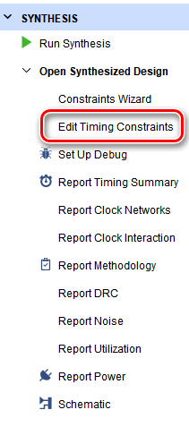

打开Timing Constraints页

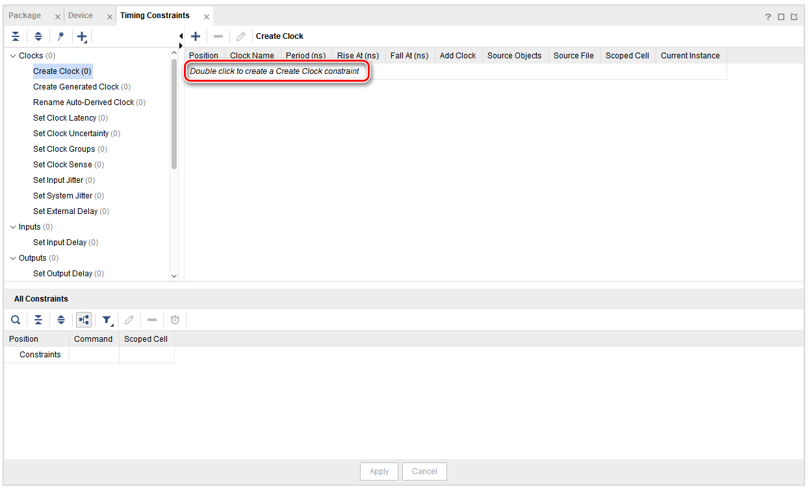

双击Double click to create a Create Clock Constraint提示

在Create Clock窗口查找时钟并设置时钟周期

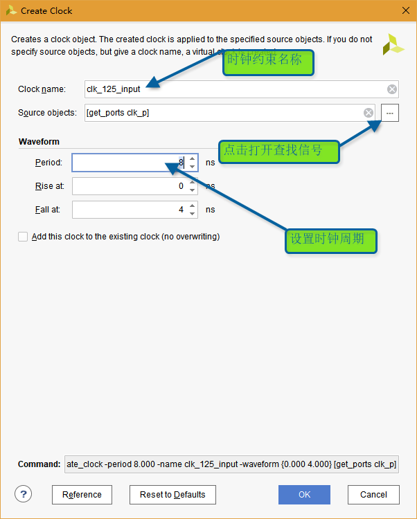


在Timing Constraints页面出现新建的时钟约束

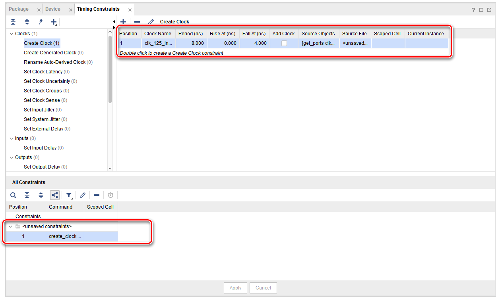

保存后在pl_top.xdc文件内出现时钟约束代码

```verilog
create_clock -period 8.000 -name clk_125_input -waveform {0.000 4.000} [get_ports clk_p]
```

# 实现

在IMPLEMENTATION选择Run Implementation

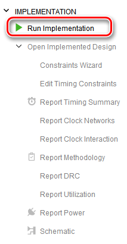

弹出窗口按默认设置选择OK开始实现

结束后的弹出窗口中选择Open Implemented Design（或者在Flow Navigator的IMPLEMENTATION项下选择）

在Timing页，可以看到时钟约束全部通过


# 生成并烧写


# 仿真

# 调试

