# UART的设置

本文档继承zcu102_1建立的工程，打开Vivado工程后，打开Block Design，双击zynq模块进入配置界面

在PS UltraScale+ Block Design页可以看到UART0和UART1已使能

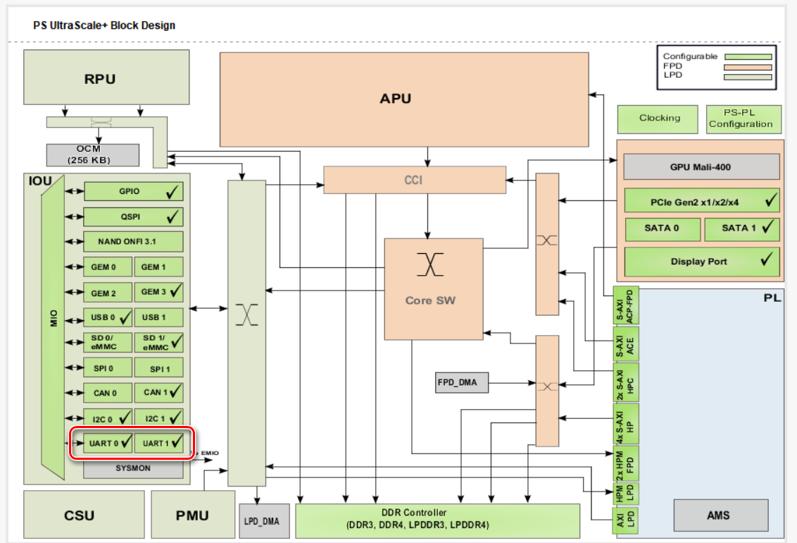

点击图中的UART0或者UART1进入I/O Configuration页并打开UART设置

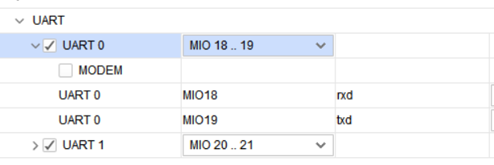

根据ug1182的说明，前述的2个UART接口通过CP2108 USB-to-Quad-UART bridge实现USB转串口功能，按照xtp435的说明安装转换芯片的驱动

在Windows 10的设备管理器中可以看到安装完成后的4个串口


其中Interface 0对应UART0，Interface 1对应UART1

之后根据xtp435的说明安装Tera Term用于串口调试

# 运行Hello World工程

**该示例用于展示将UART接口用于向主机发送调试信息，仅用print函数即可**

在Vivado工程的File菜单选择Launch SDK，新建uart_test工程，使用Hello World模板，点击Finish完成

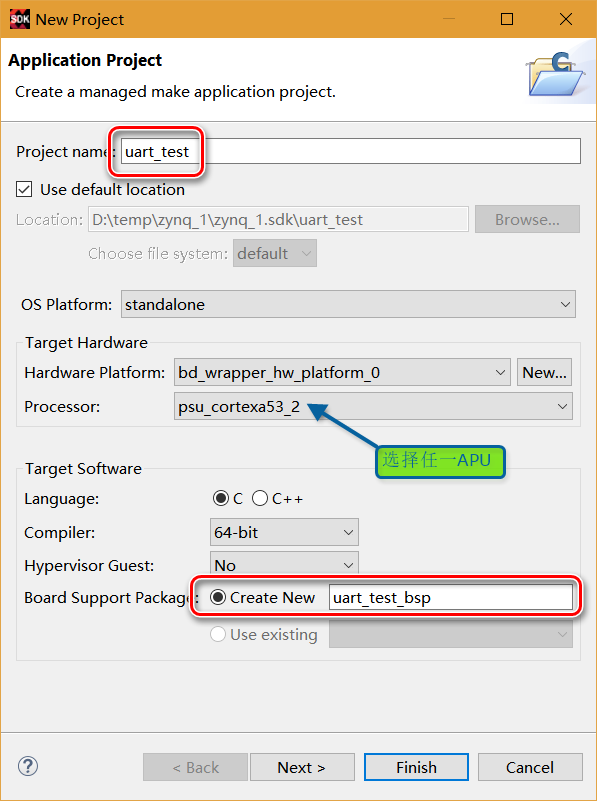

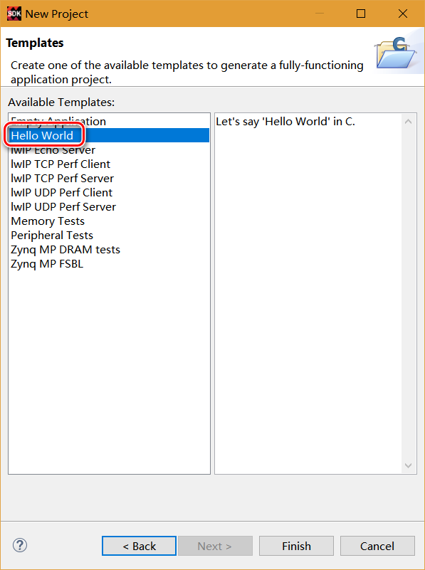

打开uart_test工程的helloworld.c文件，注释掉无用代码

```c
#include <stdio.h>
#include "platform.h"
#include "xil_printf.h"


int main()
{
//    init_platform();//无用

    print("Hello World\n\r");

//    cleanup_platform();//无用
    return 0;
}
```

在uart_test_bsp工程上右键菜单选择Board Support Package Settings


打开Board Support Packages Settings窗口，选择standalone页，可以看到stdin和stdout都连接至uart0

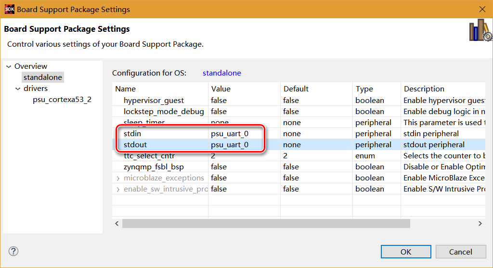

关闭窗口，在uart_test工程的右键菜单选择Build Project，编译工程

打开Tera Term软件，选择串口Interface 0


在Setup菜单选择

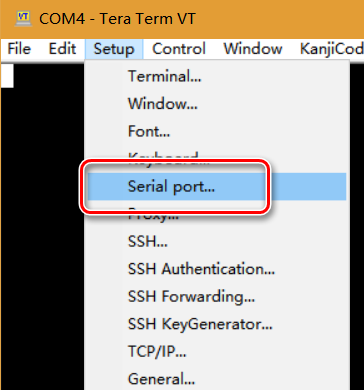

在弹出的串口设置菜单中进行如下设置

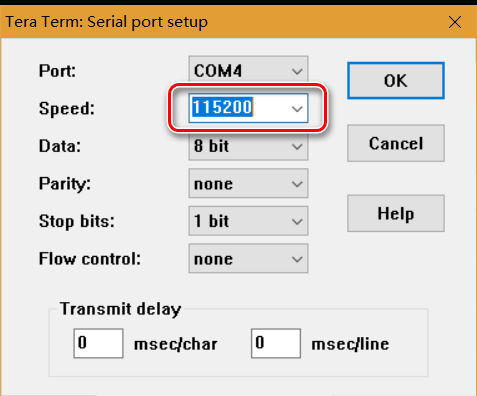

zcu102板卡上电，启动uart_test

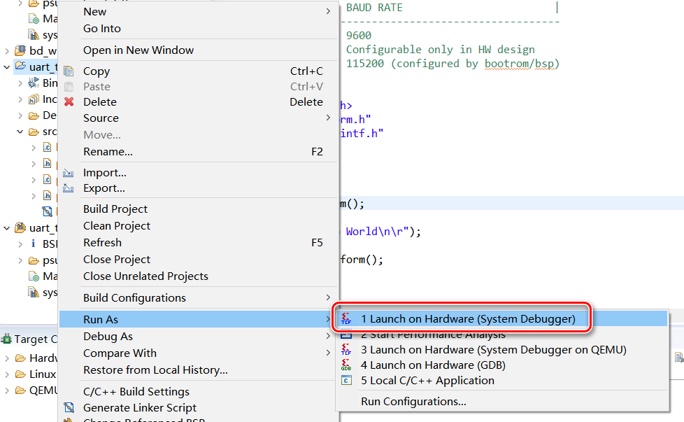

在Tera Term界面出现Hello World字符

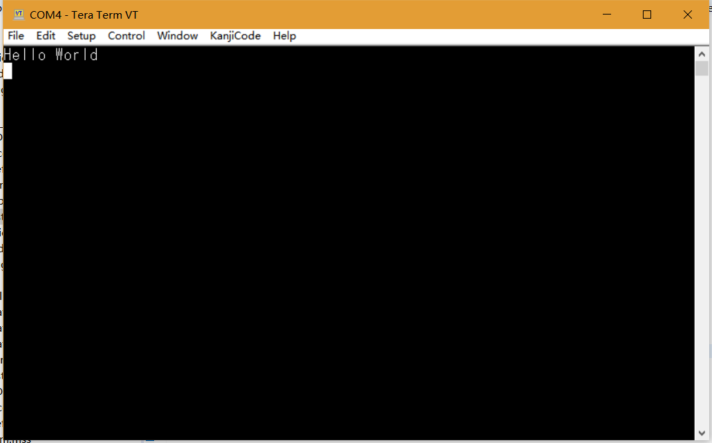

打开Board Support Packages Settings窗口，选择standalone页，将stdout都连接至uart1


按照前述方法运行uart_test程序，在Tera Term查看Interface 1的连接，即COM5

正确接收Hello World字符


---

以下内容参考system.mss内psu_uart_0或者psu_uart_1的Documentation和Import Examples

# UART发送数据

新建uart_send工程，使用uart_test_bsp，同样使用Hello World模板

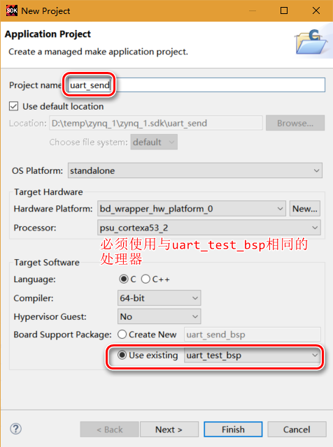

将helloworld.c原有代码改成如下

```c
#include "xparameters.h"
#include "xuartps.h"
#include "xil_printf.h"

int main()
{
	//使用UART0实现发送数据
	XUartPs Uart_Ps;//uart对象

    //查找uart配置
	XUartPs_Config *Config;
	Config = XUartPs_LookupConfig(XPAR_XUARTPS_0_DEVICE_ID);//ID来源于xparameters.h
	if (Config == NULL)
	{
		//在bsp中设置为uart1负责stdout
		print("failed XUartPs_LookupConfig\n\r");
		return XST_FAILURE;
	}
	else
	{
		print("succeed XUartPs_LookupConfig\n\r");
	}

	//uart初始化
	int Status;
	Status = XUartPs_CfgInitialize(&Uart_Ps, Config, Config->BaseAddress);
	if (Status != XST_SUCCESS)
	{
		print("failed XUartPs_CfgInitialize\n\r");
		return XST_FAILURE;
	}
	else
	{
		print("succeed XUartPs_CfgInitialize\n\r");
	}

	//设置波特率
	XUartPs_SetBaudRate(&Uart_Ps, 9600);

	//发送字节
	for (int i = 0; i < 10; ++i)
	{
		//0x30~0x39对应ASCII码值的0~9
		XUartPs_SendByte(Config->BaseAddress, 0x30+i);//阻塞
	}

	//发送数组
	u8 array[] = "\n\ruart_send by bt_";
	XUartPs_Send(&Uart_Ps, array, sizeof(array));//非阻塞

    return 0;
}
```

设置Tera Term的COM4为波特率9600（匹配上述代码）

设置COM5为波特率115200

运行uart_send程序，Tera Term显示如下：


# UART接收数据

新建uart_recv工程，使用Hello World模板

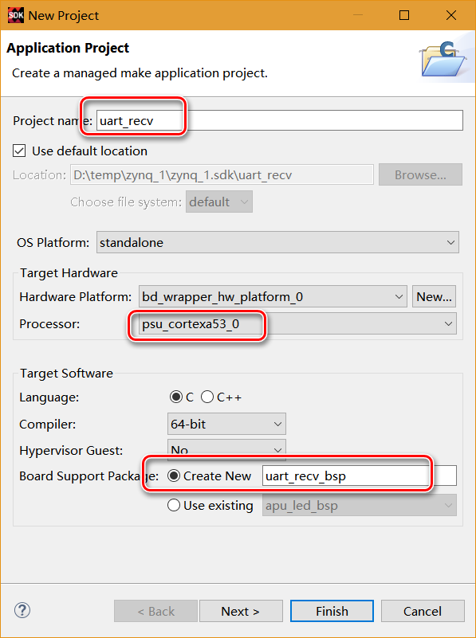

将helloworld.c中原有代码改成如下：

```c
#include "xparameters.h"
#include "xuartps.h"
#include "xil_printf.h"
#include "sleep.h"

int main()
{
	//使用UART0实现发送数据
	XUartPs Uart_Ps;//uart对象

    //查找uart配置
	XUartPs_Config *Config;
	Config = XUartPs_LookupConfig(XPAR_XUARTPS_0_DEVICE_ID);//ID来源于xparameters.h
	if (Config == NULL)
	{
		//在bsp中设置为uart1负责stdout
		print("failed XUartPs_LookupConfig\n\r");
		return XST_FAILURE;
	}
	else
	{
		print("succeed XUartPs_LookupConfig\n\r");
	}

	//uart初始化
	int Status;
	Status = XUartPs_CfgInitialize(&Uart_Ps, Config, Config->BaseAddress);
	if (Status != XST_SUCCESS)
	{
		print("failed XUartPs_CfgInitialize\n\r");
		return XST_FAILURE;
	}
	else
	{
		print("succeed XUartPs_CfgInitialize\n\r");
	}

	//接收缓冲
	u8 buf[64];

	//接收字节数
	u32 recv_cnt = 0;

	while (TRUE)
	{
		usleep(500000);//等待500ms
		recv_cnt = XUartPs_Recv(&Uart_Ps, buf, 64);//接收数据
		if (recv_cnt > 0)
		{
			//返回接收到的数据
			xil_printf("%s", buf);

			//清空缓冲
			memset(buf, 0, 64);
		}
	}

    return 0;
}
```

为了方便自动发送，于是使用*友善串口调试助手*进行测试，发现UART接收功能正确


# 关于UART接收的一些说明

本实验原本是打算使用通过中断来响应UART数据到达，再使用XUartPs_Recv进行接收，但是无论怎样实验都无法进入中断响应函数。

并且发现来自system.mss里的中断示例程序同样也无法正常进入中断响应函数。


**无法确定是不是有一些在Vivado工程或者bsp里的设置不正确导致**

根据以往嵌入式程序的开发经验，对于单线程运行的程序而言，持续接收数据如果使用中断来响应接收的话会占用更多的CPU时间（因为保存与重载现场的操作），相比较而言采用轮询的方式可以达成更高的运行效率。对于偶然突发的数据接收，使用中断接收相比较轮询接收，可以实现更快速的响应。