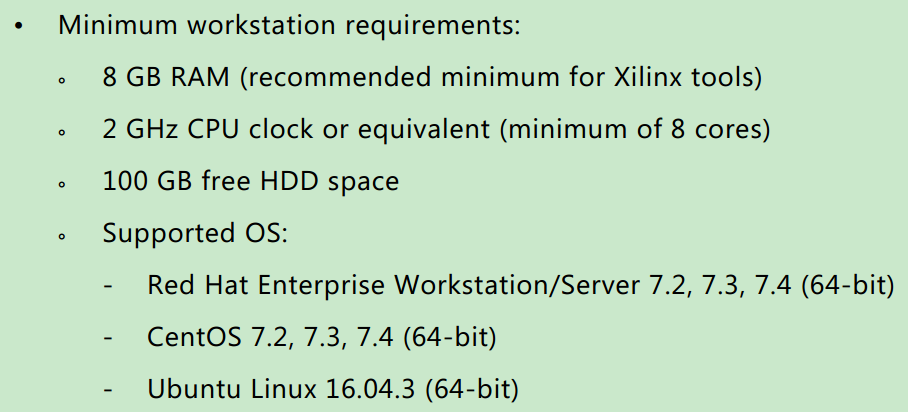
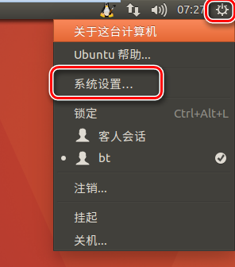
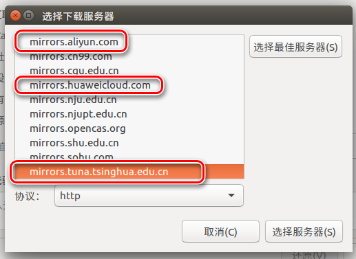
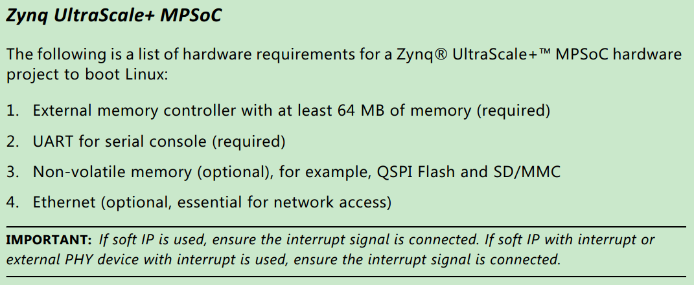
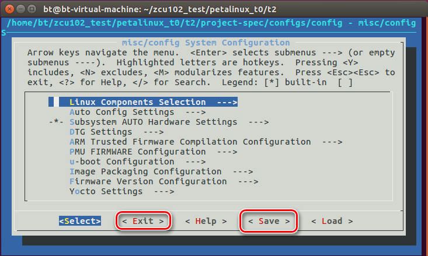
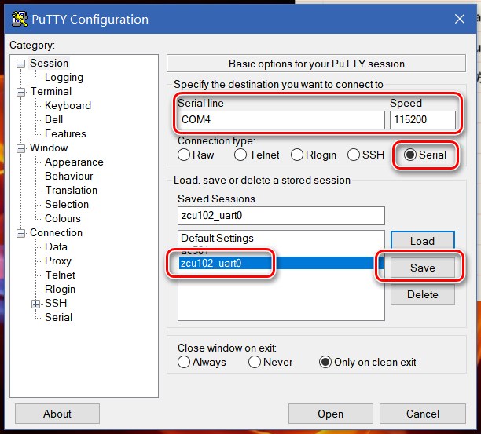
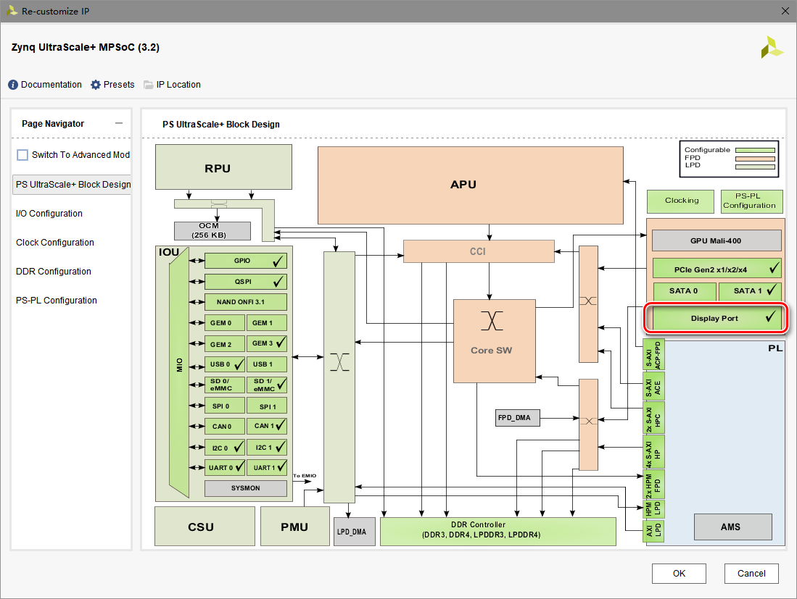
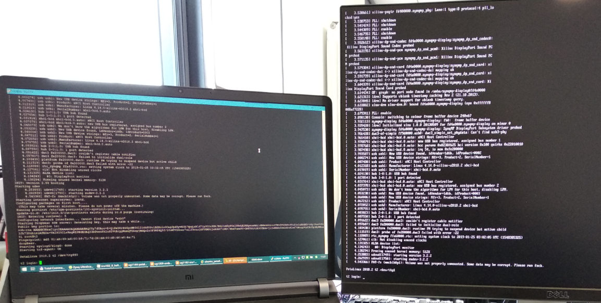
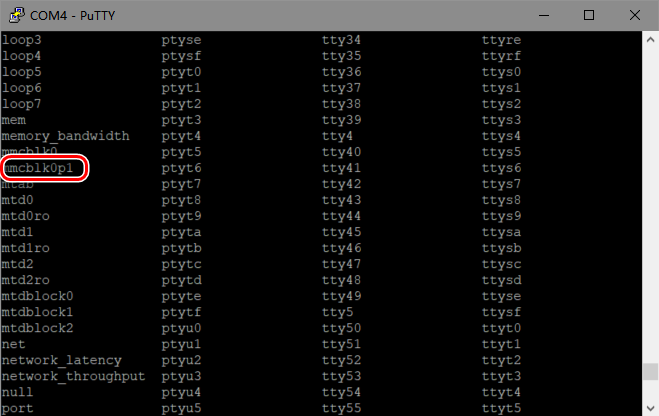
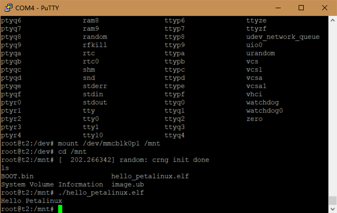

# 安装PetaLinux

由于本人习惯在Windows环境下做FPGA开发，因此将PetaLinux安装在Linux虚拟机中

开发环境如下：

-   Windows 10

-   Vivado 2018.2.1

-   VMware Workstation 14 Pro

-   Ubuntu 16.04.5 desktop amd64

-   Petalinux 2018.2

安装过程主要参考ug1144，注意Ubuntu系统全程接入互联网

1.  在Windows 10系统内安装VMware Workstation虚拟机软件
2.  在VMware中按照ug1144的要求建立虚拟机并安装Ubuntu系统（**虚拟机硬盘空间至少分配128GB**）



3.  根据VMware提示，安装VMware Tools
4.  进入Ubuntu系统，打开系统设置，进入软件和更新，切换至国内的安装源（阿里、华为或者清华）






3.  进入Ubuntu系统中，打开终端（快捷键：Ctrl+Alt+T），运行以下指令更新系统组件
    -   sudo apt-get update
    -   sudo apt-get upgrade
4.  在Windows系统，进入[Xilinx官网下载PetaLinux](https://www.xilinx.com/support/download/index.html/content/xilinx/en/downloadNav/embedded-design-tools.html)，选择2018.2版本与Vivado版本相匹配


5.  将下载完成后的安装包petalinux-v2018.2-final-installer.run导入Ubuntu系统中
6.  根据ug1144的Installation Requirements，在Ubuntu系统终端安装必须的系统组件（以tofrodos为例）
    -   安装：sudo apt-get install tofrodos
    -   查找：apt-cache search tofrodos*
7.  在终端进入安装包所在路径，修改安装包权限
    -   sudo chmod 777 petalinux-v2018.2-final-installer.run
8.  在主文件夹建立petalinux安装目标文件夹（**在ug1144中示例使用的是/opt路径，由于Ubuntu权限控制，安装及使用都不方便**），/home/bt/petalinux
9.  在终端进入安装包所在路径，安装PetaLinux
    -   ./petalinux-v2018.2-final-installer.run /home/bt/petalinux
    -   根据文字提示完成安装

# 硬件设计

在[下载PetaLinux的页面](https://www.xilinx.com/support/download/index.html/content/xilinx/en/downloadNav/embedded-design-tools.html)同样可以下载PetaLinux的板级支持包，在官方支持的开发板上可以方便地生成镜像文件

但是实际开发过程中，无论是否使用指定的开发板，建议还是使用自定义硬件生成镜像文件

为了方便达成ug1144要求的硬件配置（Creating Hardware Platform with Vivado），在Block Design使用Run Block Automation



仿照zcu102_8文档中的DMA设计，建立PL通过axi_dma向PS发送数据的硬件工程


参考之前的设计流程，生成Bitstream文件，并且Export Hardware

# 生成镜像

进入Ubuntu虚拟系统，打开终端

1.  配置PetaLinux环境：source <petalinux安装路径>/settings.sh
2.  进入工作路径，创建工程：petalinux-create -t project --template zynqMP -n <工程名称>
    -   查看命令帮助：petalinux-create --help
    -   在当前工作路径下会建立以工程名称命名的工程文件夹
3.  将硬件工程文件夹内.sdk文件夹下的hdf文件导入Ubuntu内的工程文件夹下
4.  进入PetaLinux建立的工程文件夹，打开PetaLinux配置：petalinux-config --get-hw-description=./
    -   --get-hw-description用于指示hdf硬件设计文件所在的文件夹，./表示当前文件夹
    -   在配置界面选择Save后，Exit退出



5.  **由于在硬件设计中使用了axi_dma，编译PetaLinux工程时会由于bug导致失败，按照[Xilinux官网AR# 71136](https://www.xilinx.com/support/answers/71136.html)的说明处理**
    -   在上述页面下载补丁文件[0001-Workaround-to-fix-the-dma-clock-issue.patch](https://www.xilinx.com/Attachment/0001-Workaround-to-fix-the-dma-clock-issue.patch)，并考入<工程文件夹>/project-spec/meta-user/recipes-bsp/device-tree/files文件夹下
    -   用文本编辑器打开<工程文件夹>/project-spec/meta-user/recipes-bsp/device-tree/device-tree.bbappend文件，并且用以下内容替换后保存

```tex
FILESEXTRAPATHS_prepend := "${THISDIR}/files:"

SRC_URI +="\
    file://system-user.dtsi \
    file://0001-Workaround-to-fix-the-dma-clock-issue.patch \
"
```

6.  终端内进入当前工程文件夹，编译PetaLinux：petalinux-build
7.  完成编译后，进入<工程文件夹>/images/linux文件夹，打包镜像文件，完成后在该文件夹下生成BOOT.BIN文件
    -   petalinux-package --boot --fsbl <工程文件夹>/images/linux/zynqmp_fsbl.elf --fpga <工程文件夹>/images/linux/system.bit --u-boot <工程文件夹>/images/linux/u-boot.elf
8.  将SD卡插入PC主机，格式化为FAT32格式
9.  将<工程文件夹>/images/linux文件夹下的BOOT.BIN文件和image.ub文件考贝至SD卡

# 运行PetaLinux

将SD卡插入zcu102板卡，并且将板卡加载方式改为SD卡加载


在[putty官网](https://putty.org/)下载putty


启动putty，并且如下图配置，为方便多次使用选择Save保存



点击Open打通迅界面

zcu102板卡上电，在putty界面显示启动信息


输入用户名root，密码root，进入Linux系统


由于在硬件设计中使能了PS模块的DP输出，可以连接zcu102板的DP输出接口至显示器，可以看到与putty界面相同的内容





但是由于没有输入接口，putty实现的串口交互在显示器上并不显示

# Linux程序

在Vivado硬件工程中，由File菜单Lauch SDK

建立新工程


选择Hello World模板


在src文件夹下打开helloworld.c文件，并且改为以下代码：

```c
#include <stdio.h>

int main()
{
    printf("Hello Petalinux\n");

    return 0;
}
```

编译完成后在Debug目录下生成了可执行文件hello_petalinux.elf


将elf文件考入前文所述的SD卡中

将SD卡插入zcu102板卡，重新上电启动PetaLinux系统

登入root账号后，进入/dev查看SD卡设备

-   cd /dev
-   ls

其中**mmcblk0p1设备即为当前SD卡**



将SD卡挂载至/mnt目录，进入/mnt目录并打开

-   mount /dev/mmcblk0p1 /mnt
-   cd /mnt
-   ls

可以看到SD卡内的文件


在命令行输入以下命令，则执行elf文件

-   ./hello_petalinux.elf

功能正确，打印出Hello Petalinux

