此实验实现了在PetaLinux上运行Qt图形界面程序，效果仅用于演示，不包含有意义的实际功能，具体细节的实现见后续的文档。

本文主要内容在于PetaLinux镜像定制和Qt在Windows环境下的交叉编译

# 建立PetaLinux镜像

PetaLinux的安装见zcu102_9文档。

为方便实现，Petalinux的硬件设计使用[PetaLinux的板级支持包](https://www.xilinx.com/support/download/index.html/content/xilinx/en/downloadNav/embedded-design-tools.html)，注意下载版本与PetaLinux版本2018.2相匹配

打开Ubuntu虚拟机，进入终端命令行

1.  根据ug1144要求，将ubuntu终端默认的dash改成bash

    >`sudo dpkg-reconfigure dash`
    >
    >弹出窗口中选择否
    >
    >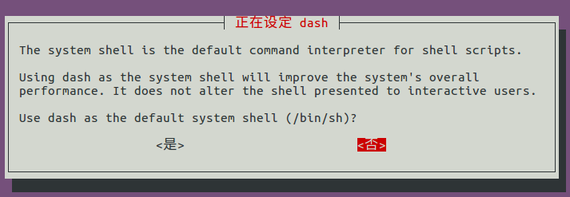

2.  配置PetaLinux运行环境

    >`source <PetaLinux安装路径>/settings.sh`

3.  建立PetaLinux工程，以工程名作为工程文件夹名称

    >`cd <工程文件夹的上层路径>`
    >
    >`petalinux-create -t project -s <zcu102板级支持包bsp文件路径> -n <工程名>`

4.  配置PetaLinux

    >   `cd <工程名>`
    >
    >   `petalinux-config`
    >
    >   打开配置界面后，选择Save后Exit，保持默认配置
    >
    >   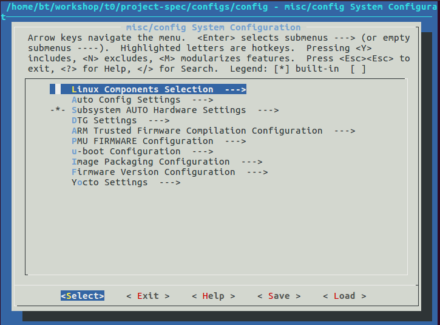

5.  参考ug1144 ch7 Adding a Package Group，**添加Qt和X11的Package Group**，Qt用于Qt程序运行环境，X11作为图形环境

    >   `petalinux-config -c rootfs`
    >
    >   选择进入Petalinux Package Groups
    >
    >   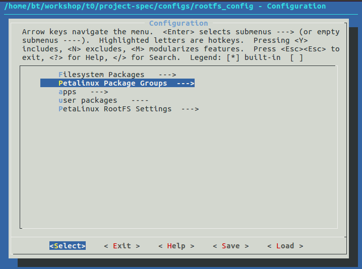
    >
    >   进入packagegroup-petalinux-qt
    >
    >   
    >
    >   按键Y，添加packagegroup-petalinux-qt
    >
    >   
    >
    >   同样的操作方法：
    >
    >   进入packagegroup-petalinux-qt-extended添加packagegroup-petalinux-qt-extended
    >
    >   进入packagegroup-petalinux-x11添加packagegroup-petalinux-x11
    >
    >   **注意：packagegroup内的-dev或者-dbg添加之后，在petalinux-build过程中会出错，导致终端自动关闭，目前未找到原因**
    >
    >   Save之后Exit

6.  编译PetaLinux

    >   `petalinux-build`

7.  打包镜像文件

    >   `petalinux-package --boot --fsbl images/linux/zynqmp_fsbl.elf --fpga images/linux/system.bit --u-boot images/linux/u-boot.elf`

# 运行PetaLinux

将<PetaLinux工程目录>/images/linux文件夹下的BOOT.BIN和image.ub考入SD卡

SD卡插入zcu102板卡，并且将板卡加载方式改为SD卡加载

在Windows系统打开putty（参考zcu102_9文档），zcu102板卡上电启动

在putty中输入用户名root和密码root后登入PetaLinux系统

使用`uname -a`显示当前PetaLinux系统信息，**注意：aarch64表示是64位ARM系统**

进入/usr/lib目录，查看Qt库文件，**可以发现PetaLinux的packagegroup内的Qt版本为5.9.4**

显示的Qt库文件如下：

./libQt5WebKit.so.5
./libQt5QuickWidgets.so.5
./libQt5EglFSDeviceIntegration.so.5
./libQt5X11Extras.so.5.9
./libQt5Sensors.so.5.9
./libQt5Concurrent.so.5.9.4
./libQt5OpenGL.so.5.9
./libQt5Core.so.5.9.4
./libQt5WebKit.so.5.9
./libQt5WebKitWidgets.so.5
./libQt5Script.so.5
./libQt5X11Extras.so.5.9.4
./libQt5ScriptTools.so.5.9
./libQt5Declarative.so.5
./libQt5Xml.so.5.9
./libQt5EglFSDeviceIntegration.so.5.9.4
./libQt5Test.so.5.9.4
./libQt5Xml.so.5
./libQt5Sql.so.5.9.4
./libQt5PrintSupport.so.5
./libQt5XmlPatterns.so.5
./libQt5Quick.so.5.9.4
./libQt5Core.so.5.9
./libQt5PrintSupport.so.5.9.4
./libQt5Quick.so.5
./libQt5Test.so.5
./libQt5XcbQpa.so.5.9.4
./libQt5Gui.so.5.9
./libQt5Qml.so.5.9
./libQt5DBus.so.5.9.4
./libQt5Network.so.5.9
./libQt5EglFSDeviceIntegration.so.5.9
./libQt5Declarative.so.5.8.0
./libQt5Positioning.so.5
./libQt5QuickWidgets.so.5.9
./libQt5OpenGL.so.5
./libQt5QuickParticles.so.5
./libQt5WebKitWidgets.so.5.9
./libQt5Gui.so.5.9.4
./libQt5QuickParticles.so.5.9
./libQt5Charts.so.5.9.4
./libQt5Core.so.5
./libQt5Xml.so.5.9.4
./libQt5XcbQpa.so.5.9
./libQt5DBus.so.5.9
./libQt5Location.so.5.9
./libQt5Svg.so.5
./libQt5Script.so.5.9
./libQt5Widgets.so.5.9
./libQt5Location.so.5
./libQt5Declarative.so.5.8
./libQt5Network.so.5
./libQt5XcbQpa.so.5
./libQt5Sql.so.5.9
./libQt5Concurrent.so.5
./libQt5Sensors.so.5
./libQt5Charts.so.5
./libQt5QuickParticles.so.5.9.4
./libQt5Gui.so.5
./libQt5Widgets.so.5.9.4
./libQt5Widgets.so.5
./libQt5Charts.so.5.9
./libQt5WebKit.so.5.9.2
./libQt5Qml.so.5
./libQt5QuickTest.so.5.9.4
./libQt5Network.so.5.9.4
./libQt5QuickWidgets.so.5.9.4
./libQt5X11Extras.so.5
./libQt5Quick.so.5.9
./libQt5OpenGL.so.5.9.4
./libQt5QuickTest.so.5
./libQt5Script.so.5.9.4
./libQt5Sensors.so.5.9.4
./libQt5XmlPatterns.so.5.9
./libQt5Concurrent.so.5.9
./libQt5PrintSupport.so.5.9
./libQt5DBus.so.5
./libQt5XmlPatterns.so.5.9.4
./libQt5Positioning.so.5.9.4
./libQt5Qml.so.5.9.4
./libQt5WebKitWidgets.so.5.9.2
./libQt5Positioning.so.5.9
./libQt5Svg.so.5.9
./libQt5Test.so.5.9
./libQt5ScriptTools.so.5
./libQt5Sql.so.5
./libQt5ScriptTools.so.5.9.4
./libQt5Svg.so.5.9.4
./libQt5Location.so.5.9.4
./libQt5QuickTest.so.5.9

# 下载Qt安装包及源码

由于PetaLinux的packagegroup内的Qt版本为5.9.4，因此下载Windows环境下的[5.9.4版本的Qt安装包](http://download.qt.io/archive/qt/5.9/5.9.4/)

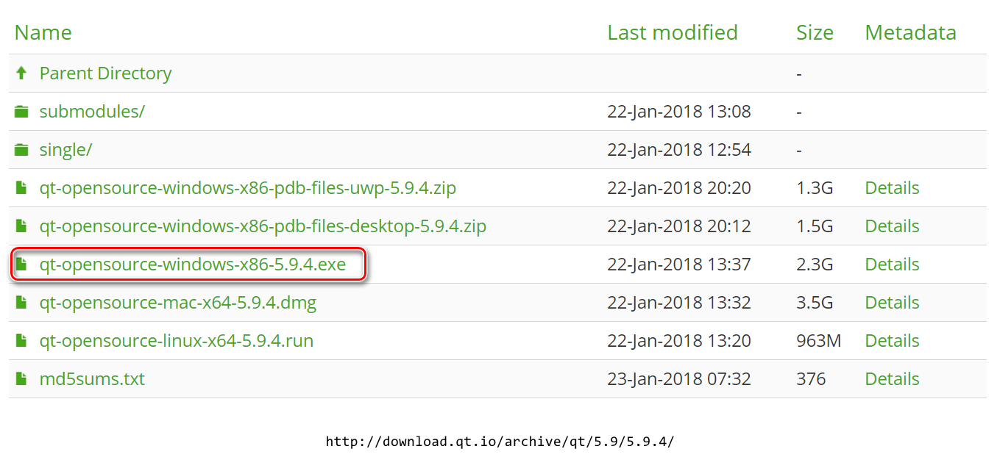

下载[5.9.4版本的Qt源码](http://download.qt.io/archive/qt/5.9/5.9.4/single/)，**注意：zip用于Windows系统下的编译**

# Windows环境下的Qt交叉编译

主要参考<https://www.cnblogs.com/qinwanlin/p/6956833.html>，该参考文档对应的是32位的系统，本文改成64位Linux系统

## 安装Qt

双击运行qt-opensource-windows-x86-5.9.4.exe

按下图配置，注意Qt库为MinGW 5.3.0 32bit，Tools选择安装MinGW 5.3.0

安装完成后将<Qt安装路径>\Tools\mingw530_32\bin添加至系统环境变量Path

>   打开文件资源管理器
>
>   此电脑图标上右键菜单选择属性，打开系统窗口
>
>   选择“高级系统设置”，打开系统属性窗口
>
>   点击“环境变量”按钮，在系统变量中找到Path，点击“编辑”按钮
>
>   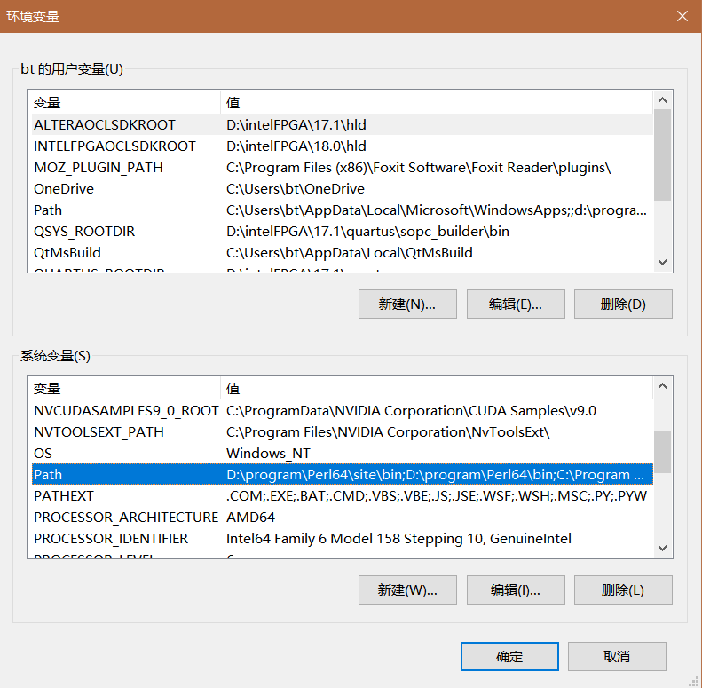

## 安装Active Perl

在[Perl下载页面](https://www.perl.org/get.html)，选择Active Perl

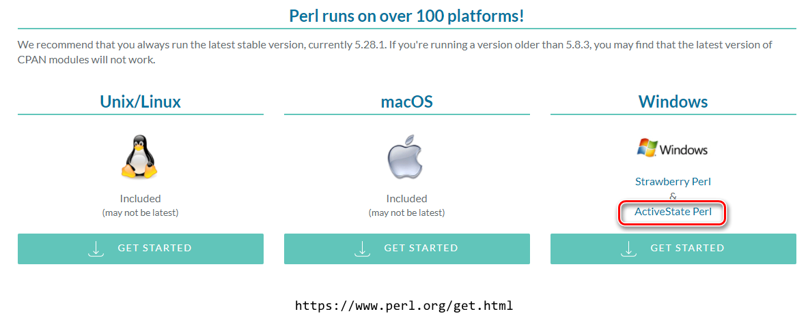

打开的页面选择Windows Installer(EXE)

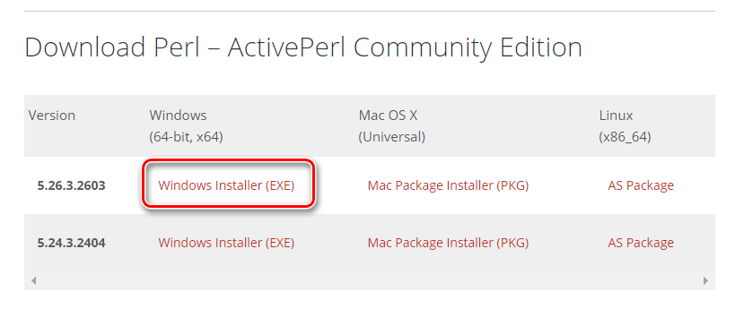

安装时选择添加至环境变量Path，或者安装完成后手动将<安装路径>\bin添加环境变量

## 安装Python

在[Pyton下载页面](https://www.python.org/downloads/)，下载并安装Python（本实验主机上安装的是Python 3.6.7）

安装完成后将<安装路径>添加至系统环境变量Path

## 安装Vivado System Edition

使用2018.2版本，注意安装时选中SDK，安装完成后将<Vivado安装路径>\SDK\2018.2\gnu\aarch64\nt\aarch64-linux\bin\添加至系统环境变量Path

此路径**包含PetaLinux系统aarch64的编译器**

## 交叉编译

重启Windows系统，使前文添加的所有环境变量生效

解压[Qt源码zip包](#下载Qt安装包及源码)

在源码路径的qtbase\mkspecs文件夹可以找到linux-aarch64-gnu-g++文件夹

用文本编辑器打开文件夹内的qmake.conf

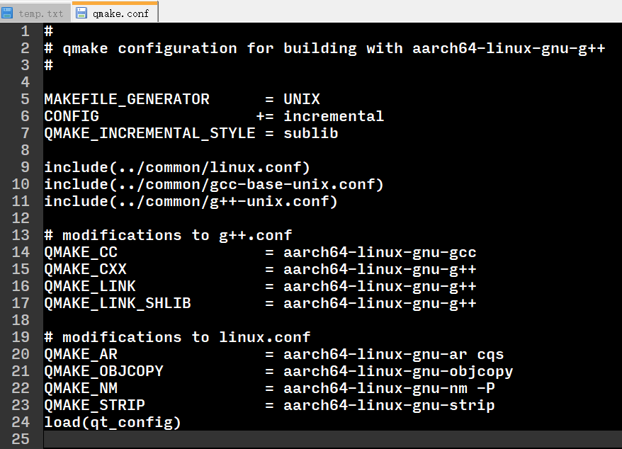

可以看到所有的编译器都包含在<Vivado安装路径>\SDK\2018.2\gnu\aarch64\nt\aarch64-linux\bin\路径下

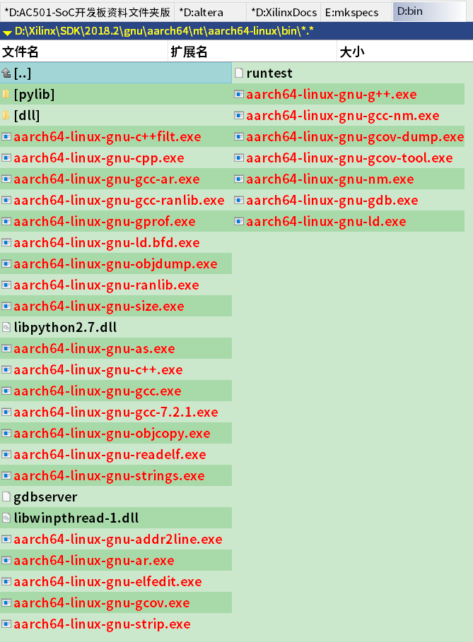

在Windows10开始菜单打开命令提示符

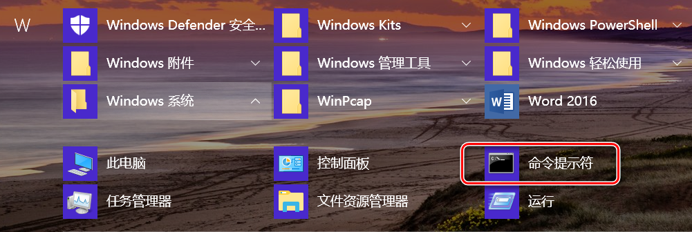

进入Qt源码文件夹，开始交叉编译

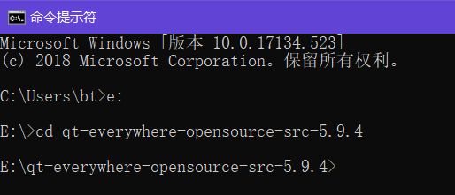

1.  configure

    >   `configure.bat -release -opensource -xplatform linux-aarch64-gnu-g++ -prefix D:\qt_arm_64 -nomake tests -nomake examples -no-opengl -skip qtdeclarative -skip qtandroidextras -skip qtquickcontrols -skip qtquickcontrols2 -skip qtvirtualkeyboard -skip qtwayland -skip qtscript -skip qtwebengine -skip qtnetworkauth -skip qtremoteobjects -skip qtspeech -skip qtscript -skip qtpurchasing`
    >
    >   -xplatform 表示使用源码路径qtbase\mkspecs\linux-aarch64-gnu-g++文件夹内的配置
    >
    >   -prefix 指示安装路径
    >
    >   -no-opengl 表示不安装OpenGL，**PetaLinux不支持OpenGL**
    >
    >   -skip 表示不安装的qt工具包，工具包的名称即为源码路径下的文件夹名称
    >
    >   **注意：如果不skip工具包qtdeclarative，则后续的mingw32-make和mingw32-make install都会在qtdeclarative报错，在PetaLinux的/usr/lib文件夹内也未发现qml相关的库文件，可能是PetaLinux不支持qml**

2.  make

    >   `mingw32-make -j10`
    >
    >   -j10 表示10个线程运行，根据主机CPU线程数进行设置，数值越大越快

3.  make install

    >   `mingw32-make install`

至此交叉编译完成，编译后的Qt库安装至D:\qt_arm_64

# 编写Qt程序

## 配置编译环境

启动Qt Creator，在Tools菜单选择Options，在Options窗口选择进入Build & Run

在Qt Versions页，添加qmake，路径位于<源码编译目标路径>\bin

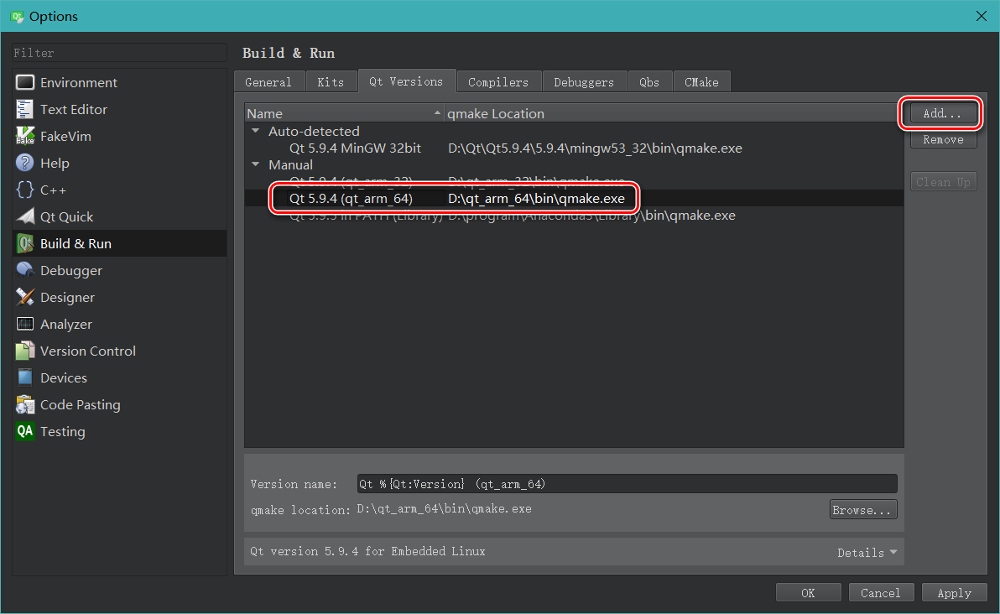

在Compilers页，添加GCC的C++编译器aarch64-linux-gnu-g++，添加GCC的C编译器aarch64-linux-gnu-gcc，路径位于<Vivado安装路径>\SDK\2018.2\gnu\aarch64\nt\aarch64-linux\bin\

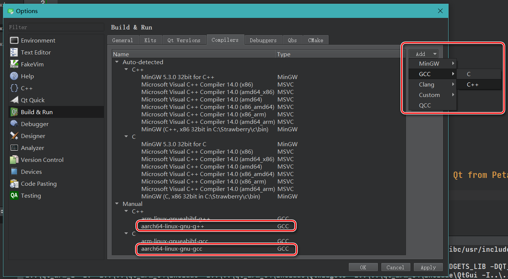

**注意，配置ABI为arm-linux-general-elf-64bit**

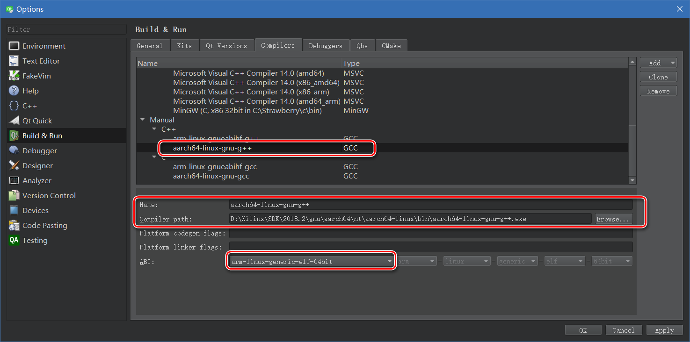

在Debuggers页添加aarch64-linux-gnu-gdb，路径位于<Vivado安装路径>\SDK\2018.2\gnu\aarch64\nt\aarch64-linux\bin\

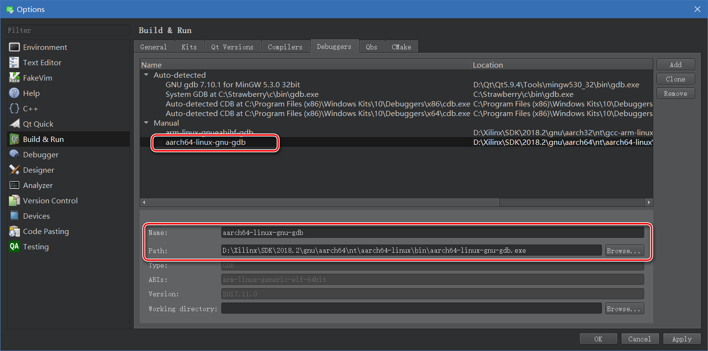

在CMake页添加mingw32-make，路径位于<Qt安装路径>\Tools\mingw530_32\bin

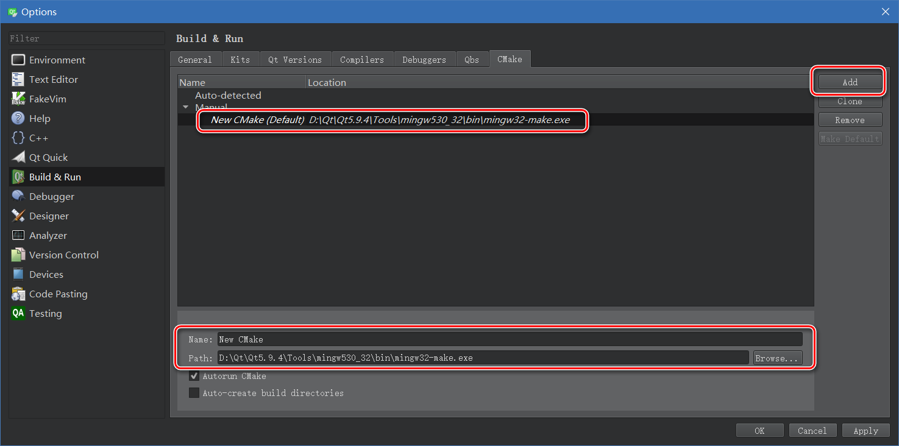

在Kits页添加arm_64编译环境

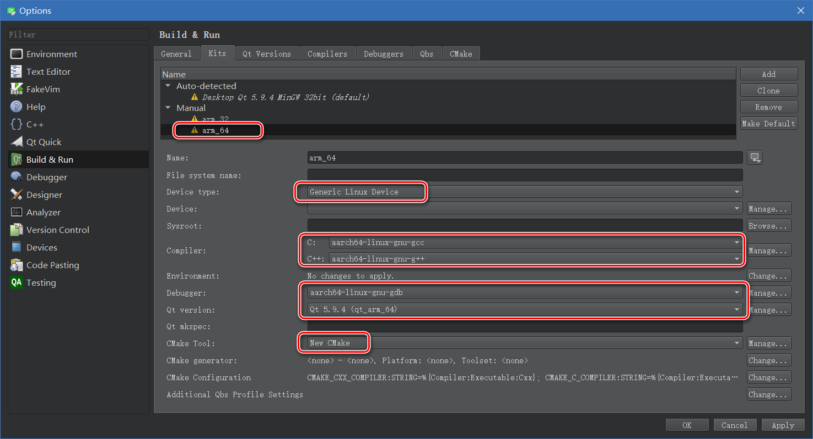

## 建立Qt工程

建立Qt Widgets Application工程，选中arm_64编译环境

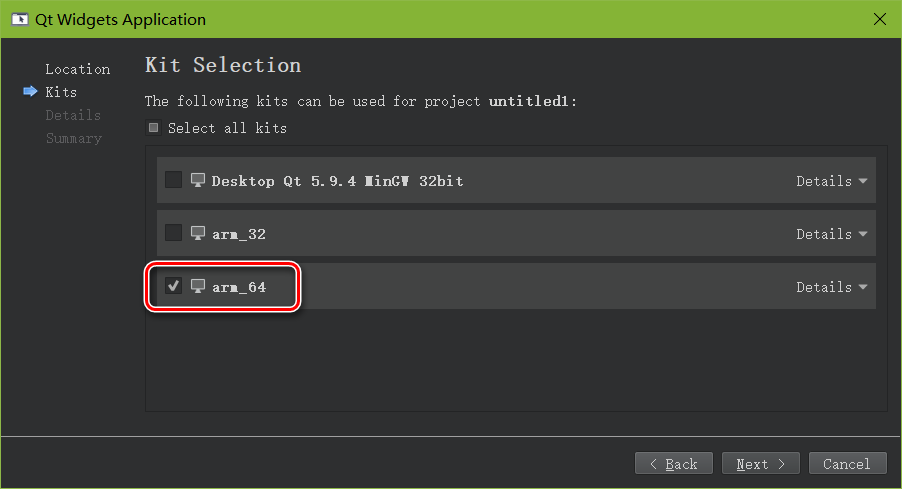

**前述的Qt Creator设置仍然无法在arm_64编译环境找到Make，需要在工程中手动设置**

打开工程后，在Projects设置界面，添加Override make为mingw32-make，路径位于<Qt安装路径>\Tools\mingw530_32\bin

以Release编译为例，Debug设置相同

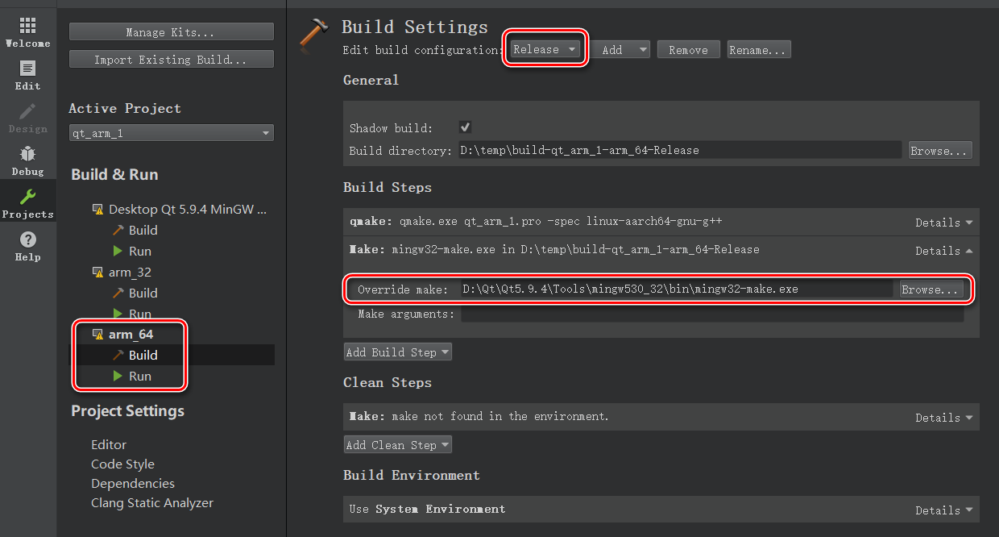

Build之后在Build路径下生成可执行文件，在windows下无法运行

# 运行Qt程序

将前述生成的可执行文件考入SD卡，按照[运行PetaLinux](#运行PetaLinux)的说明启动PetaLinux并登入root账号

参考ug1209，启动图形显示界面

**注意：`/usr/bin/Xorg &`指令中的&表示当前为后台进程，如果没有&将默认作为前台进程占用命令行，将无法执行其它指令**

当前界面按下Enter键回到命令行

挂载SD卡，并执行Qt程序qt_arm_1

在zcu102的DP口输出的显示器上显示Qt程序已运行

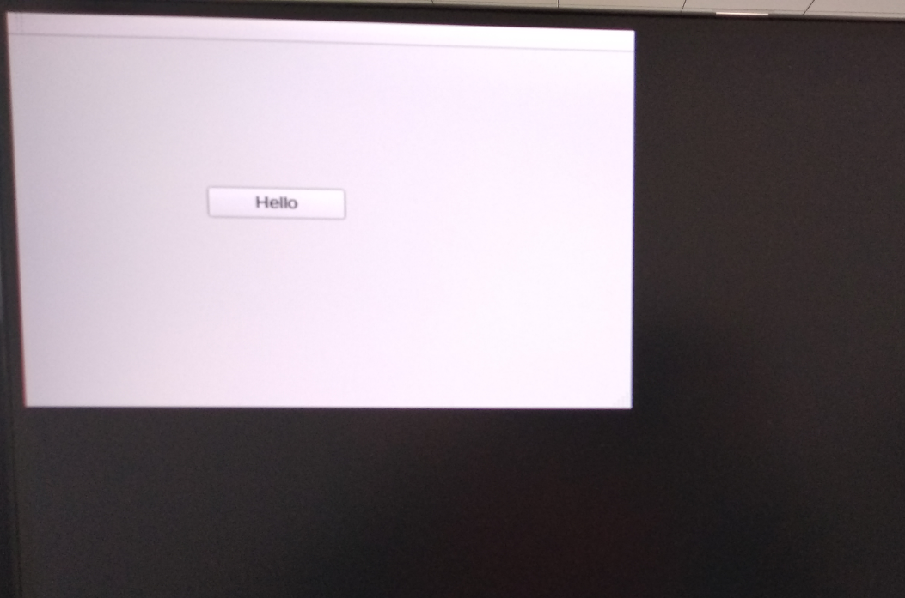