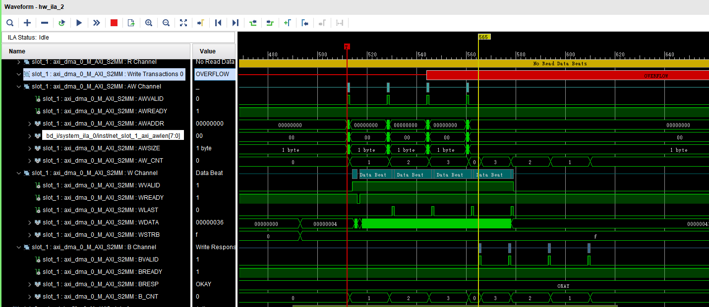

### 0104 9:20

**AXI DMA模块的使用：**

-   M_AXI_MM2S和M_AXI_S2MM通过AXI SmartConnect与PS的AXI Slave连接（目前不确定为什么使用AXI Interconnect会出错）

-   S_AXI_LITE是控制接口，通过AXI Interconnect与PS的AXI Master连接，用于由PS控制DMA传输
-   S_AXIS_S2MM是写接口，M_AXIS_MM2S是读接口


### 0104 18:23

BSP工程中

xparameters_ps.h中定义了PS的DDR内存地址XPAR_DDR_MEM_BASEADDR和XPAR_DDR_MEM_HIGHADDR 

xil_io.h的函数用于内存读写操作


### 0104 21:55

**AXI_FULL与AXI_LITE必须通过AXI Interconnect或者AXI SmartConnect才能连接**

**XAxiDma_Busy**可用于判断dma传输是否已完成，这样可以不使用中断判断


### 0104 22:02

用z8的ila查看mm2s和s2mm的时序，即dma与ps的接口交互情况


### 0104 22:19

dma模块的width of buffer length register对应的buffer大小单位可能是byte

==见[后续说明](#0107 13:40)==


### 0104 22:23

==待办上板试验：==

1.  使用最新的z8程序，查看ila中全部的AXI接口流程，找到与PS的transfer指令的对应关系（压缩包==z8_20190104_2==）
2.  在SDK中将RX指令放在TX指令之前
3.  试验DMA仅处理单个方向
4.  试验单个DMA连接PS上2个slave接口分别进行2个方向的传输
5.  仿照zcu106示例程序建立工程并试验


### 0105 7:51

SDK中对DDR的写操作，为防止数据进入数据cache，需要使用Xil_DCacheFlushRange，把数据cache中的数据全部冲至DDR中

在中断中使用的变量，如果在非中断函数中还要使用（比如标志变量），定义时需要加上volatile前缀，防止读取cache中的缓冲值而非DDR中的实际数值

Xil_DCacheInvalidateRange好像是将数据同步至cache

==cache怎样使用？==

**向内存中写数之后用Xil_DCacheFlushRange，将数据从数据cache(DCache)冲入内存**

**从内存中取出数据（或者查看数据）之前，Xil_DCacheFlushRange将数据从数据cache(DCache)冲入内存**


### 0105 7:59

XAxiDma_IntrAckIrq函数用于通知PS中断已响应，清除中断标志位，axi_dma模块对应的introut会变为低电平


### 0105 8:11

**tkeep**信号用于指示packet传输时，最后1拍(beat)，即tlast有效时tdata上哪几个字节有效，防止传输数据量并非总线字节数的整数倍。**如果tkeep存在，但是不使用，需要将tkeep设为全高电平**

**tstrb(strobe)**信号用于指示每1拍传输时，tdata上哪几个字节有效


### 0105 8:16

在z8的dma工程中发现部分axi的master和slave端口的设置不一致，比如tkeep或者tstrb信号的有无

==是否可能由此产生错误？==可能性非常大，**这类信号由于axi总线封装导致难以查看，于是错过，一定注意要检查！！！！**

**一定要保证所有的AXI输入端口都有正确的连接，不能空接。Messages中的warning大多数是提示这样的问题**


### 0105 8:43

在master_axi_stream数据源和axi_dma写接口之间加入axi_stream_data_fifo

==试验压缩包z8_20190105_1==


### 0105 9:12

之前的测试中由PS启动s2mm传输，则S_AXIS_S2MM的tready会变为高并且一直保持

==有没有可能是数据源master的代码有错？==，导致数据没有进入S_AXIS_S2MM

仿真发现tlast比tvalid多出1个时钟周期有效，虽然多出的时钟周期tvalid已变为0，但是不确定是否会引起问题

==试验压缩包z8_20190105_2==


### 0105 10:20

==发现示例程序中axi_dma的S_AXIS_S2MM接口的tkeep全部接高电平==

==而当前的z8程序没有tkeep的接口，是否表示默认空接为全部低电平，导致接收失败==

将tkeep连接至全高电平

==试验压缩包z8_20190105_3==


### 0105 18:03

emio和mio的说明见ug1085的general purpose io的章节

注意emio的使用时配置ps模块只能设置其数目，在SDK编码时其pin number数值从mio的pin number之后开始递增

0~77为MIO

78~173为EMIO


### 0105 18:36

axi_gpio见pg144

在SDK查看xgpio.h的封装，不用直接使用地址映射


### 0105 18:49

axi_bram使用地址映射进行读写操作


### 0107 7:18

试验z8_20190105_3

XAxiDma_SimpleTransfer发送在首轮循环成功一次后，第二轮返回失败

XAxiDma_SimpleTransfer接收首轮循环返回成功，但是内存中未收到数据

只使用接收一样不能收到数据，而且第二轮同样返回失败

是否可以理解为无论是发送还是接收，实际在第一轮都未执行完成，第二轮发起时直接失败


### 0107 7:30

FPGA Debug发现PS接口上无论读写接口都保持tready有效

==非常怀疑是由于AXI总线部分信号接入ila后都未重新与对端连接，导致传输失败==

试验去掉全部ila


### 0107 8:28

去掉全部ila之后，XAxiDma_SimpleTransfer一直返回成功，但是仍未接收到数据

采用分支方式连上axi总线进行调试


### 0107 9:01

mm2s和s2mm传输过程中，dma模块的M_AXI接口都只有第一次正确响应，之后无响应


### 0107 9:54

关闭s2mm传输后，mm2s传输每次都能正确响应

==仍然收不到tx中断==

接下来试验关闭mm2s情况下的s2mm传输是否正确？


### 0107 10:02

关闭mm2s情况下的s2mm第一次传输PS正确接收到数据，之后则无响应

并且首次发送的数据为4，5，6，7，而期望的是0~3，可能与复位有效，==可能需要在fifo和自定义数据源连接dma的复位信号==


### 0107 10:09

**文档中应当说明block design中对连线标记debug后，出现自动连线提示，连线后接入System ILA**


### 0107 10:21

==可能是s2mm流程未结束导致，第二轮的mm2s也无法启动==

但是s2mm为什么未结束？哪里的原因？


### 0107 10:29

==使用XAxiDma_Busy函数在PS里查看s2mm传输，发现一直没有完成==


### 0107 11:24

禁用PS内的dma中断，s2mm传输的错误与前述一样


### 0107 12:33

发现stream data fifo输出的M_AXIS中包含tstrb接口，而dma模块的S_AXIS_S2MM无tstrb接口，因此在stream data fifo中将此接口去掉

试验发现错误与前述一样


### 0107 13:40

==一次发送的最大数据量是由width of buffer length register决定，即2^width-1个字节==

是由buffer length寄存器决定的

指的是在内存中绑定的用于传输的缓冲空间，一次传输量只能小于此空间大小，根据源代码查看发现还得再减去1个字节

在XAxiDma_SimpleTransfer函数中发送数据量参数判断处可以查看

**注意在不使用tkeep的情况下，不能transfer非总线字节数整数倍的数据量**


### 0107 14:54

==在调试中发现OVERFLOW==



哪来的？

是System ILA设置burst数目的问题


### 0107 15:39

备份z8_20190107_1


### 0107 16:50

去掉mm2s和中断功能，发现s2mm的错误与前述一样


### 0107 17:04

==发现PS在一次运行中，并没有在内存中收到数据，而是重新relaunch之后才能在内存中看到数据==


使用Xil_DCacheInvalidateRange禁用接收内存缓冲的cache，问题仍然一样


### 0108 7:01

使用Xil_DCacheFlushRange，错误


### 0108 7:31

将s2mm的connect与ps的接口放入ila查看

发现接口功能正常


### 0108 8:20

首次运行载入FPGA后，再次运行使用reset apu和run psu_init，可以在PL端再次启动传输

只有run psu_init或者只有reset apu，也可以

PS运行时没有任何配置项，也可以

是因为重新运行，dma被初始化了？


### 0108 8:29

示例程序中使用

**Xil_DCacheInvalidateRange((u32)RxPacket, Length);**

确保查看接收数据时，直接从内存中取数，而不是从cache中取数


### 0108 9:07

将传输大小换成4096B，仍然失败


### 0108 9:40

s2mm的dmasr寄存器表示启动后halted就保持为1，在halted保持为1的情况下，idle固定为0

即XAxiDma_Busy返回True

首次传输后


### 0108 9:55

查看s2mm的状态寄存器sr

首次transfer之前值为1

首次transfer之后值为0

等待100ms

下次transfer之前为0x5011

无论transfer多少次一直保持

0x5011表示

halted=1

DMAIntErr=1 DMA内部错误

IOC Irq=1

Err Irq=1

==中断错误==

查看控制寄存器，发现中断全部被禁用


### 0108 10:17

查看控制寄存器cr发现功能正确

查看长度寄存器buffer length

首次transfer之前为0，

首次transfer之后无论多少次transfer都保持0x1000，即transfer参数设置的传输长度


### 0108 10:52

在网上找到一个回答

https://forums.xilinx.com/t5/Embedded-Processor-System-Design/AXI-DMA-with-custom-AXI-streaming-IP-in-Zynq/td-p/303917

==相同的问题，表示原因在于DMA的s2mm输入没有收到tlast==

调试发现z8当前data fifo连接dma模块没有tlast有效，结果发现进入data fifo的数据就没有tlast


### 0108 11:04

仿真发现自定义的数据源模块正常产生tlast


### 0108 13:47

在自定义IP或者需要加入Block Design的Verilog语言模块时，将parameter定义成如下才可以在双击模块时进行参数设置

```verilog
module src #
	(
		// Users to add parameters here
		
		// User parameters ends
		// Do not modify the parameters beyond this line

		// Width of S_AXIS address bus. The slave accepts the read and write addresses of width C_M_AXIS_TDATA_WIDTH.
		parameter integer C_M_AXIS_TDATA_WIDTH	= 32
	)
	(
```


### ==0108 14:05 实现s2mm传输==

终于解决s2mm的问题，原因在于自定义的数据源模块使用了寄存器与parameter的计算的比较，仿真可以正确解析，但是Block Design无法理解（可能出现了计算扩位）

```verilog
if ({tlast, tvalid, M_AXIS_TREADY, cnt_burst} == {1'b0, 1'b1, 1'b1, (BURST_NUM-8'd1)}) begin
```

修改后变成

```verilog
if ({tlast, tvalid, M_AXIS_TREADY, cnt_burst} == {1'b0, 1'b1, 1'b1, 8'd15}) begin
```

终于正确了


### 0108 14:23

**s2mm接收数据后，数据首先在dcache中，需要用Xil_DCacheFlushRange或者Xil_DCacheInvalidateRange将dcache中的数据冲入内存再使用**


### 0108 17:42

==双向dma传输都正确，但是PS程序不响应dma中断==

文档加入validate出现的excluded address警告


### 0109 7:40

==PS接收DMA时，接收大小设置为512B或者128B，但是PL首次发送48B之后一直发送64B==

在buffer length register中的数值与48B和64B一致

但是在status register中首次发送之后出现ioc_irq，并且一直保持


### 0109 9:07

使用昨天的仅有s2mm的测试工程也出现一样的结果，昨天漏看传输的的数据量了


### 0109 9:34

查看昨天的[调试截图](#0107 14:54)，发现昨天传输数据量正确

这是怎么回事？

==差异在于昨天截图时的程序没有正确的tlast==

问题与tlast有关？


### 0109 10:05

**axi_dma的s2mm通道有16字节缓冲，复位后可以装入16字节**

dma启动s2mm传输后，dma的S_AXIS_TREADY会控制收到最大burst的数据量，收到以后在M_AXI_S2MM发送一个Packet

但是如果S_AXIS_TREADY有效的过程中在S_AXIS出现了tlast，则认为用户数据结束，于是停止s2mm传输

**注意注意注意！！！s2mm传输时，S_AXIS接口的tlast必须对齐一次transfer的最后1个burst！！！！**


### ==0109 10:32解决s2mm传输数据量错误的问题==

将s2mm数据源和对应的fifo的复位连接至axi_dma的s2mm_prmry_reset_out_n，数据源和fifo用同一复位，防止数据丢失。另一方向防止axi_dma复位前进入的数据被复位清除，而fifo却无法重发。

并且将数据源的packet数据量设置为与sdk一次transfer的数据量一致

修改后数据全部传输完成


### 0109 12:30

PS中使能中断的情况下，首次传输完成后axi_dma模块的2个introut都变成高电平，并且一直保持

使用XAxiDma_IntrDisable之后，传输完成后2个introut都不再变成高电平，一直保持低电平


### 0109 13:38

在调试中发现中断对象在调用XScuGic_Connect函数之后正确更新了对应中断号的handler函数地址和函数参数地址


### 0109 16:41

==试验SDK中的DMA中断控制示例程序，仍然无法进入中断响应函数，问题不在SDK中的编程，而在于Vivado工程==


### 0109 17:33

**SDK只有Run才能执行中断，而Debug不能执行中断**

